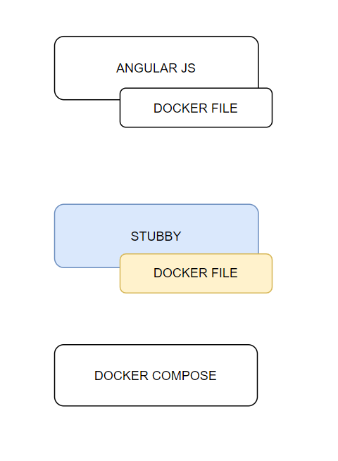

# rest-mocks

## Stubby4node

Objetivos:

- Extraer el directorio rest-mocks de la práctica Angular
- Dockerizar la aplicación

]

## Instrucciones

Crear la imagen:

```
$ docker build --no-cache -t mock-server .
```

Ejecutar el contenedor:

```
$ docker run -p 8080:9003 mock-server
```

Salida
```
Using stubby v5.1.0
Loaded: GET ^/accounts$
Loaded: GET ^/accounts/(\w.*)$       
Loaded: GET ^/loans$
Loaded: GET ^/loans/(\w.*)$
Loaded: GET ^/beneficiaries$
Loaded: POST ^/transfer$
Loaded: POST ^/payments/loans/(\w.*)$
Watching for changes in ./endpoints.json...

Quit: ctrl-c

Stubs portal running at https://0.0.0.0:7443
Stubs portal running at http://0.0.0.0:9003 
Admin portal running at http://0.0.0.0:8889 
```

Consultar el endpoint:

```
[
    {
        "id": "1000-0000-0001",
        "maskedNumber": "****-****-0001",
        "currency": "USD",
        "type": "saving",
        "balance": {
            "available": 1000.90,
            "total": 1000.90
        }
    },
    {
        "id": "1000-0000-0002",
        "maskedNumber": "****-****-0002",
        "currency": "USD",
        "type": "saving",
        "balance": {
            "available": 988.51,
            "total": 988.5190
        }
    },
    {
        "id": "1000-0000-0003",
        "maskedNumber": "****-****-0003",
        "currency": "USD",
        "type": "saving",
        "balance": {
            "available": 0,
            "total": 0
        }
    },
    {
        "id": "1000-0000-09-001",
        "maskedNumber": "****-****-09-001",
        "currency": "USD",
        "type": "current",
        "balance": {
            "available": 100.01,
            "total": 100.01
        }
    },
    {
        "id": "1000-0000-09-002",
        "maskedNumber": "****-****-09-002",
        "currency": "USD",
        "type": "current",
        "balance": {
            "available": 50.00,
            "total": 50.00
        }
    }
]
```
